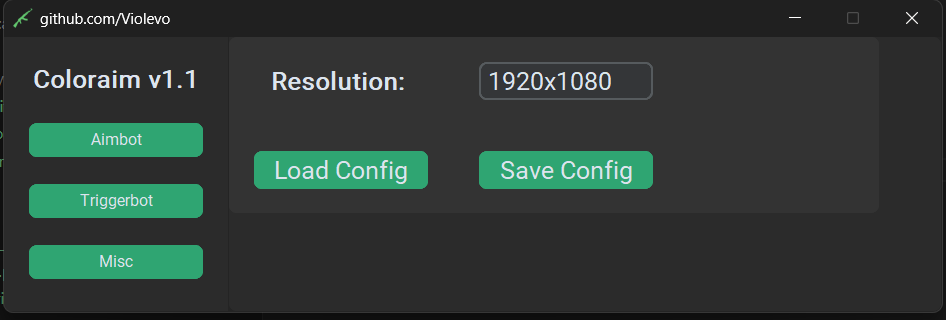
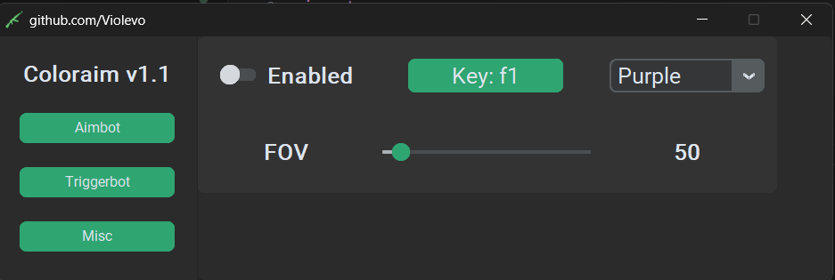

# 2PC Valorant Colorbot

A fully external 2-computer colorbot for Valorant, using NDI to transfer video frames between computers and a MAKCU device to spoof mouse movement and clicks. Because the frames are only ever analysed on the second computer, it can be very difficult for anticheats to detect. (I used this script for multiple months on my main account and have not received a ban)

https://github.com/user-attachments/assets/ac019950-a0ac-433c-b8cd-d820d9b15f62

## Features

- **Triggerbot**: Shoots when the crosshair is over an enemy
- **Aimbot**: Moves the mouse to the enemy's head
- **Humanised Aim**: Adds randomness to the mouse movement to make it look more human
- **Menu UI**: CustomTkinter UI for easy configuration on the second PC
- **NDI Source Finder**: Automatically finds NDI sources
- **MAKCU Support**: Supports Makcu device for emulating mouse movement and clicks

## Installation

#### Prerequisites

- **Main Computer**: Capable of running both **Valorant** and **OBS** simultaneously.
- **Second Computer**: Any python-capable device able to run the script. (e.g. Raspberry Pi, Laptop, Second PC)
- **MAKCU Device**: Required for emulating mouse movement and clicks. You can also use other mouse input devices but no support is provided.
- **Ethernet Connection**: A wired Ethernet connection between the main PC and the second PC for low latency, Wifi is not recommended.

On your main (gaming) computer:

- **OBS-NDI Plugin**:
  Install the [OBS-NDI](https://github.com/DistroAV/DistroAV) plugin for OBS on your main computer.

On your secondary computer:

1. **Install Python**:
   - Python 3.10 or higher from [python.org](https://www.python.org/downloads/)

2. **Install NDI SDK & Python-NDI**:
   - [NDI SDK](https://ndi.video/for-developers/ndi-sdk/) version for your specific operating system.
   - The [Python-NDI](https://github.com/buresu/ndi-python) library.

3. **Clone the repository:**

   ```bash
   git clone https://github.com/Violevo/2PC-Valorant-Colorbot
   cd 2PC-Valorant-Colorbot
   ```

4. **Set up a Virtual Environment:**

   ```bash
   python -m venv .venv
   source .venv/bin/activate  # On Windows: .venv\Scripts\activate
   ```

5. **Install Dependencies:**

   ```bash
   pip install -r requirements.txt
   ```

6. **Run the Script:**
   ```bash
   python main.py
   ```

## Overview & Project Structure

The program works as follows:

1. **OBS Captures the Valorant Game Window**:
   - OBS is captures the Valorant.exe window as a video stream
2. **The Video Stream Is Sent Over Your Local Network Using OBS-NDI**:
   - OBS streams the captured video to a second computer via the **OBS-NDI** plugin.
3. **The Second Computer Receives This Video Stream Using Python-NDI**:
   - Python-NDI receives the video stream and processes it.
4. **The Program Generates a Similarity Map**:
   - The program compares the pixels of each frame against a colour range of enemy outlines to create a similarity map. In short, this is an image of where the enemy's are in game.
5. **Triggerbot**:
   - If the crosshair has pixels from the similarity map both above and below it (+/- a few horizontal pixels), indicating it's over a player, the program triggers a click function to shoot.

6. **Aimbot Functionality**:
   - For the aimbot, the topmost pixel in the similarity map is subtracted from the crosshair’s position to create a vector (in pixels) pointing to the player’s head.
   - The amount the mouse should move for each pixel is calculated from the following formula:

     $$ 1.07437623 \times \text{Sensitivity}^{-0.9936827126} $$

7. **Triggerbot / Aimbot Data Is Transmitted Over USB**:
   - The processed data (mouse movement and triggerbot signal) is sent over USB to a **Makcu Device**.

   - The Makcu Device decodes the data and combines it with legitimate mouse movement data from the mouses sensor to create a spoofed mouse movement signal.

   - The spoofed mouse movement signal is then sent to the main computer.

### Project Structure

The project is structured as follows:

```text
├── main.py             # Entry point (root)
├── config.json         # Configuration settings
├── icon.ico            # UI Icon
├── requirements.txt    # Python dependencies
└── src/
    ├── main.py         # Main execution logic
    ├── core/
    │   └── colorbot.py # Detection & processing
    ├── drivers/
    │   ├── mouse.py    # Pico/Makcu driver
    │   └── screen.py   # NDI capture driver
    ├── ui/
    │   └── app.py      # CustomTkinter UI
    └── utils/
        └── config_manager.py
```

## Contributing & Licensing

Contributions are always welcome. If you'd like to contribute to this project, please fork the repository, create a feature branch, and submit a pull request. Here is a list of additional features that could be implemented:

- Redevelop in C++ for improved performance
- Add humanised aim (Bezier curves) + Smoothing + Randomness
- Add more features (Recoil, Instalock, etc)

### Credits

A list of recources that helped me develop this project

- [pwnhub](https://www.unknowncheats.me/forum/valorant/587689-fast-hue-l2-distance-based-color-filtering-using-numpy.html) - Good post on python color filtering.
- [Ssarkos](https://www.unknowncheats.me/forum/valorant/499748-pixel-silent-aim.html) - Where i found the sensitivity calculation.

### License

This project is licensed under the GNU GPLv3 License - see the [LICENSE](LICENSE) file for more details.

## Gallery




I am not responsible for any bans you may receive from using this project. Please use it at your own risk.
